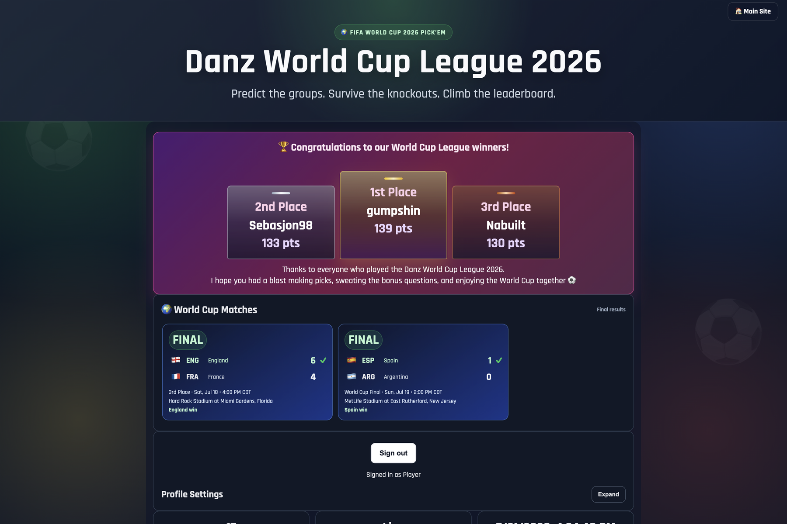
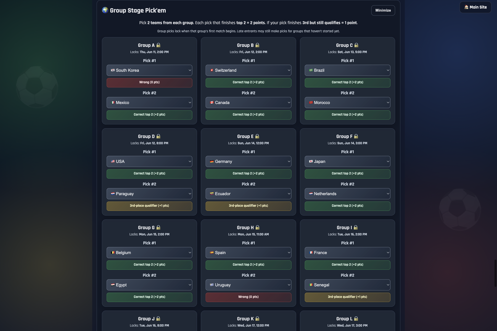
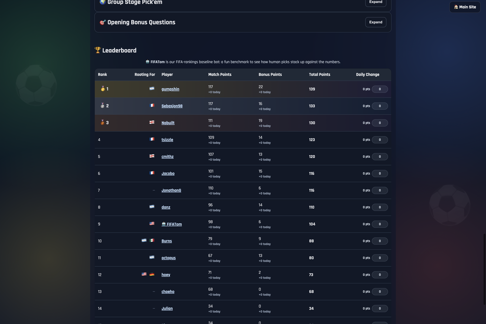

# Danz World Cup League 2026

An OpenAI Build Week 2026 project for the **Apps for Your Life** category.

Danz World Cup League 2026 turns a friend-group World Cup prediction pool into a polished, social web app. Players make picks, answer bonus questions, follow match results, compare standings, and celebrate the winners together. Admins get a scoring dashboard that replaces spreadsheet chaos with structured results, automatic scoring, and transparent point breakdowns.

| Project Thumbnail | Homepage + Winners Podium |
| --- | --- |
|  |  |
| Group Stage Pick'em | Public Leaderboard |
|  |  |

## Elevator Pitch

Most sports pools start in a group chat and end in a messy spreadsheet. Danz World Cup League 2026 turns that everyday social ritual into a full web app: friends can sign in, make World Cup picks, track live and final results, see exactly how points were earned, and celebrate the final podium together.

The app was built for a real league with real players, real scoring disputes, and real tournament edge cases. It handles match locks, hidden picks, bonus questions, admin grading, public leaderboards, and final winner celebration in one place.

## Why This Fits "Apps for Your Life"

This is a consumer app built around everyday connection. Sports pools are a familiar way friends and families experience major events together, but running one well is surprisingly hard. This app helps people spend less time managing spreadsheets and more time enjoying the tournament with their community.

It is personal, practical, reusable, and social:

- Personal: built for an actual friend-group league.
- Practical: solves the real organizer pain of collecting picks and calculating points.
- Reusable: the structure can be adapted for future World Cups, Euros, March Madness, or other tournament-style events.
- Social: leaderboards, rooting-for flags, public player picks, and a final podium make the experience feel shared.

## Core Features

### Player Experience

- Google sign-in for league participants.
- Profile settings with a custom leaderboard username.
- Rooting-for country selection with flags shown on the leaderboard.
- Group-stage picks.
- Round of 32, Round of 16, Quarterfinals, Semifinals, Third-place, and Final pickems.
- Final score predictions with clear rules around extra time and penalty shootouts.
- Bonus questions for multiple tournament stages.
- Save states, locked states, and status messages so users know their picks were recorded.
- Public leaderboard available even when logged out.
- Clickable leaderboard rows that reveal each player's picks and point details.
- Final congratulations banner with a podium finish for the top three players.

### Admin Experience

- Admin-only scoring and results dashboard.
- Official result entry for each tournament stage.
- Bonus answer key tools for opening, Round of 32, Round of 16, Quarterfinals, Semifinals, and Finals questions.
- Support for multiple accepted answers where ties or shared leaders are possible.
- Admin survey summary for final website feedback.
- Player completion checks for picks, bonus questions, and survey responses.
- Public leaderboard publishing from admin refresh.
- Banned-player controls.

### Fairness and Transparency

- Picks lock at kickoff.
- User picks stay hidden until the corresponding match starts.
- Final-score instructions are explicit: scores include extra time if played, but not penalty shootout goals.
- Exact-score points require the correct winner pick.
- Detailed public scoring entries explain where points came from.
- Bonus scoring is deterministic and guarded against duplicate "new points" when admins resave answer keys.

## Technical Overview

This is a static front-end application backed by Firebase.

### Front End

- `index.html` contains the page structure, user sections, admin sections, leaderboard, and final celebration banner.
- `styles.css` contains the responsive visual system, match ticker styling, pick cards, admin panels, leaderboard styling, and final podium treatment.
- `app.js` contains authentication, Firestore reads/writes, scoring logic, UI rendering, match lock rules, leaderboard publishing, and admin tooling.

### Backend Services

- Firebase Authentication for Google sign-in.
- Cloud Firestore for users, picks, bonus answers, official results, public leaderboard rows, rooting-for countries, and admin grading data.
- Firebase Security Rules to separate ordinary user writes from admin-only result and scoring writes.
- A Cloudflare Worker / match ticker endpoint for tournament lock times and match data during the event.

## Data Model Highlights

The app stores separate documents or collections for each major competition surface:

- `users`
- `groupPicks`
- `round32Picks`
- `round16Picks`
- `quarterfinalPicks`
- `semifinalPicks`
- `finalsPicks`
- `bonusAnswers`
- `round32BonusAnswers`
- `round16BonusAnswers`
- `quarterfinalBonusAnswers`
- `semifinalBonusAnswers`
- `finalsBonusAnswers`
- official result collections for each round
- `publicLeaderboard`
- `publicRootingFor`
- `leaderboardDailyBaselines`

This separation kept each tournament stage easier to reason about and made admin grading safer.

## Scoring System

The scoring engine covers the full tournament:

- Group-stage advancement picks.
- Knockout winner picks.
- Exact final-score bonuses.
- Extra time / penalties predictions.
- Opening tournament bonus questions.
- Round-specific bonus questions.
- Manually graded stat-based semifinal and final bonus questions.
- Final leaderboard totals and daily point deltas.

One important design decision: the leaderboard is recalculated from saved picks and official results rather than manually incremented. That makes scoring reproducible and easier to audit.

## How Codex and GPT-5.6 Were Used

OpenAI Codex with GPT-5.6 was used as the primary build partner throughout the project.

Codex helped with:

- Turning product requirements into working UI and application logic.
- Building the multi-stage pickem experience across the full tournament.
- Implementing Firebase Auth and Firestore read/write flows.
- Designing and refining the admin scoring dashboard.
- Writing deterministic scoring functions for groups, knockout rounds, bonus questions, exact scores, extra time, and penalties.
- Handling difficult tournament edge cases such as ties, multiple accepted bonus answers, extra-time score rules, and hidden picks.
- Debugging a major scoring-date issue where resaving official answer keys could make old bonus points appear as new daily points.
- Improving the public leaderboard, player detail drawers, match ticker, final podium, and mobile-responsive layouts.
- Generating and validating Firestore security rule updates for new collections.
- Running syntax checks and regression checks after each major iteration.

GPT-5.6 was especially useful as a collaborative coding and product reasoning partner. The app changed round by round as the tournament progressed, and Codex helped keep the codebase coherent while requirements evolved quickly.

## Why AI Was Important

This project was not just "write a page." It required continuous iteration under real event pressure:

- New rounds unlocked as the tournament advanced.
- Matchups became known over time.
- Admin scoring needs changed as real stats came in.
- User-facing copy needed to be precise to avoid scoring confusion.
- Bugs had to be diagnosed quickly because real players were watching the leaderboard.

Codex made it possible to move quickly while still keeping the scoring system auditable. It helped convert messy real-world requests into specific code changes, then verify those changes before moving on.

## User Flow

1. A player opens the site and sees the match ticker, leaderboard, and final announcement.
2. They sign in with Google.
3. They set a leaderboard username and choose countries they are rooting for.
4. They make available picks and answer bonus questions before the lock time.
5. After matches begin, picks become visible in leaderboard detail views.
6. As admins enter official results, the leaderboard updates with match points, bonus points, and detailed point breakdowns.
7. At the end of the tournament, the top three finishers are celebrated in the final podium banner.

## Admin Flow

1. Admin signs in with an approved email.
2. Admin panels become visible.
3. Admin enters official match results and bonus answer keys.
4. The app recalculates player points from stored answers.
5. The public leaderboard is published for all users, including logged-out visitors.
6. Admin can inspect player completion, survey feedback, and daily point breakdowns.

## Design and UX Notes

The visual design is intentionally energetic but not chaotic. The app uses:

- Dark tournament-style theme.
- Clear section cards for each competition stage.
- Compact admin panels for repeated scoring work.
- Status colors for live, final, locked, correct, and wrong states.
- Medal styling for the top three leaderboard rows.
- Gold, silver, and bronze gradients for the final podium.
- Responsive layouts that keep pick cards and score inputs usable on mobile.

## Built With

- OpenAI Codex
- GPT-5.6
- Firebase Authentication
- Cloud Firestore
- Firebase Security Rules
- Google Sign-In
- JavaScript
- HTML
- CSS
- Cloudflare Worker / World Cup ticker endpoint
- Git

## Project Structure

```text
worldcup/
  app.js
  index.html
  styles.css
  wcleague_thumbnail.png
  wcleague_thumbnail1.png
  README.md
```

## Running Locally

Because the app uses browser module imports and Firebase client SDKs, serve the folder with a local static server instead of opening the file directly.

Example:

```bash
python3 -m http.server 8123
```

Then open:

```text
http://localhost:8123/index.html
```

## Firestore Notes

The Firebase client configuration is used by the browser app. Access control belongs in Firestore Security Rules. The app expects rules that:

- allow signed-in users to read league data needed for the app,
- allow users to create/update only their own picks and profile data,
- allow admins to write official results and answer keys,
- allow public reads of the published leaderboard and rooting-for display data,
- deny unknown collections by default.

## Competition Notes

For OpenAI Build Week judges, the most important parts of this project are:

- It is a real app built for a real community.
- It solves an everyday social coordination problem.
- It has both player-facing and admin-facing functionality.
- It goes beyond a prototype by handling scoring, security, lock rules, edge cases, and final presentation.
- Codex and GPT-5.6 were central to the development process, from initial implementation to late-stage debugging and polish.

## Future Improvements

- Generalize tournament configuration so admins can create new leagues without editing code.
- Add invite links for private leagues.
- Add automated result imports from a sports data provider.
- Add player notifications before pick deadlines.
- Add reusable scoring templates for different sports.
- Add a historical archive of past league seasons.

## Final Thought

Danz World Cup League 2026 is what happens when a familiar friend-group tradition gets treated like a real product. It takes the fun of a group chat prediction pool and gives it the structure, polish, and reliability of a full app.
